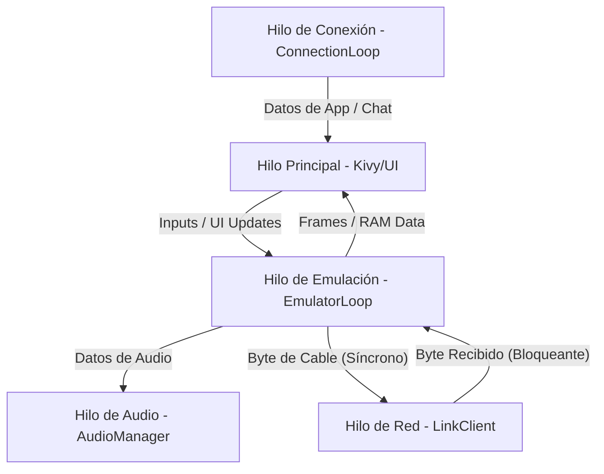

# Modelo de Hilos y Arquitectura de Concurrencia

Este documento describe la arquitectura multihilo de la aplicación Linked_crystal, detallando los diferentes hilos implicados, su propósito y cómo se sincronizan entre sí.

## Vista General

La aplicación utiliza un modelo multihilo para separar las tareas pesadas de procesamiento (emulación, audio, red) del hilo principal de la interfaz de usuario (UI), garantizando que la aplicación responda a los inputs del usuario incluso bajo carga.

---

## Detalle de Hilos

### 1. Hilo Principal (Kivy UI)
*   **Propósito:** Renderizado de la interfaz de usuario, gestión de eventos táctiles/teclado y actualización de componentes visuales.
*   **Gestión:** Iniciado automáticamente por Kivy.
*   **Sincronización:** Utiliza `kivy.clock.Clock` para recibir actualizaciones de otros hilos de forma segura (ej. actualizaciones de frames o mensajes de chat).

### 2. Hilo de Emulación (`EmulationLoop`)
*   **Propósito:** Ejecutar el núcleo de PyBoy (GBC) a 60 FPS.
*   **Archivo:** `services/emulator/emulator_loop.py`
*   **Interacciones:**
    *   Lee la RAM para el `RamScrapper`.
    *   Genera frames para el `DrawingManager`.
    *   Genera buffers de audio para el `AudioManager`.
    *   **Punto Crítico:** Envía y recibe bytes de Link Cable a través del `LinkClient`.

### 3. Hilo de Audio (`AudioManager`)
*   **Propósito:** Reproducir el sonido generado por el emulador sin interrupciones.
*   **Archivo:** `services/audio/audio_manager.py`
*   **Implementación:**
    *   **Desktop:** Utiliza `sounddevice` con un buffer resiliente.
    *   **Android:** Utiliza un hilo dedicado (`_android_writer_thread`) que escribe continuamente en un `AudioTrack` de la API nativa de Android.
*   **Sincronización:** Utiliza un `threading.Lock` para proteger el buffer de muestras (`_playback_buffer`).

### 4. Hilo de Link Cable (`LinkClient`)
*   **Propósito:** Gestionar la comunicación WebSocket para la emulación del cable link.
*   **Archivo:** `services/connection/link_cable/link_client.py`
*   **Naturaleza:** Es un hilo híbrido que corre un loop de `asyncio` para la red.
*   **Sincronización:** Utiliza `SmartLinkQueue`. Cuando el emulador pide un byte, este hilo puede llegar a bloquear al emulador si no hay datos disponibles del compañero.

### 5. Hilo de Conexión General (`ConnectionLoop`)
*   **Propósito:** Mantener la conexión con el servidor para datos persistentes, chat y estados globales.
*   **Archivo:** `services/connection/main_conn/connection_loop.py`
*   **Naturaleza:** Corre en un hilo independiente con su propio loop de `asyncio`.
